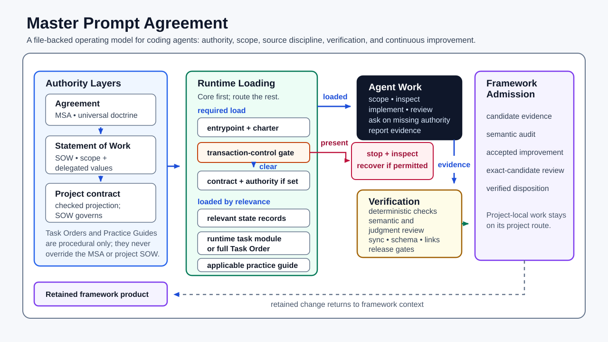
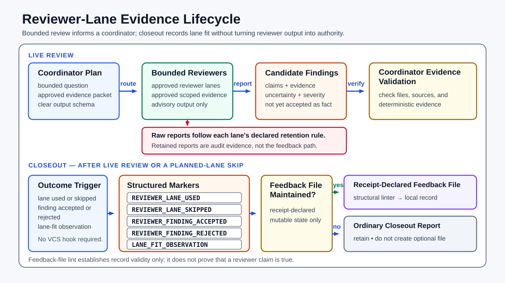

# Master Prompt Agreement

A file-backed operating model for coding agents.

Master Prompt Agreement gives a filesystem-capable agent explicit project
authority, current facts, workflow routes, source boundaries, and acceptance
evidence. It separates durable project instructions from chat history and loads
specialist guidance only when the work needs it.

The framework is designed to complement capable models and native agent
runtimes, not to restate what they already do well. Implemented product behavior
remains owned by code, configuration, tests, and other executable project
sources. Framework text earns its place only when it supplies missing project
authority, current context, verification duties, or a reusable procedure.

Repository checks establish structural and conformance properties. They do not,
by themselves, prove that the framework universally improves agent output. Any
effectiveness claim must stay within the evidence that was actually collected.

<picture>
  <source media="(max-width: 960px)" srcset="assets/framework_runtime_loop_mobile.svg">
  
</picture>

[Open the wide framework overview](assets/framework_runtime_loop.svg) or the
[narrow-layout overview](assets/framework_runtime_loop_mobile.svg).

## Choose Your Path

| Situation | Use |
|---|---|
| The target has no framework-generated surfaces and no collision at any selected managed output path | [Getting Started](GETTING_STARTED.md) and the [Initialization Task Order](task_orders/init.md) |
| The target has no framework-generated surface, but an ordinary file occupies a selected managed output path | Preserve it; choose a reviewed non-colliding layout or perform a project-specific integration/relocation before bootstrap |
| The target is a verified, complete current-format instance | [Updating A Generated Project](UPDATING.md) and the [Framework Refresh Task Order](task_orders/framework_refresh.md) |
| The target came from the public pre-v2 line | Preserve it and follow the [v1-to-v2 migration guide](docs/migrating_v1_to_v2.md) |
| The target is partial, malformed, inconsistent, or otherwise unrecognized | Preserve it and follow the [unsupported-format route](UPDATING.md#unsupported-formats) for a reviewed project-specific update |
| The target declares a newer schema | Use a framework checkout that supports it; do not interpret or rewrite it with the current checkout |
| You want to understand the architecture | [Concepts](docs/concepts.md), [Architecture](ARCHITECTURE.md), and the [interactive guide](docs/interactive/index.html) |
| You are maintaining or releasing the framework | [Governance](GOVERNANCE.md) and [Maintenance And Release](docs/maintenance_and_release.md) |

The current public line uses the v2/current-format architecture. A project
created from `v1.0.0` or a later pre-v2 public snapshot is not a valid input to
the current refresh workflow. Preserve that project and follow the
[v1-to-v2 migration guide](docs/migrating_v1_to_v2.md) for a reviewed, one-time
transition. The migration route does not add a compatibility layer or ongoing
legacy support. Public release versions are distinct from the version markers
used by individual framework documents, generated contracts, and schemas.

In a Codex checkout, `$master-prompt-new-project` and
`$master-prompt-refresh-project` are optional thin launchers for the same
canonical setup and update procedures. They are not separate workflows.

## What The Framework Owns

Master Prompt Agreement makes these questions inspectable:

- What is in scope, and what is explicitly out of scope?
- Which project facts, commands, tools, and sources are current?
- What requires approval before the agent acts?
- Which workflow and specialist standard apply to this task?
- What evidence proves completion, and what remains manual or unresolved?
- Where do active work, durable decisions, and reusable feedback belong?

It is not a legal-services product, a prompt pack, a generic agent wrapper, or a
replacement for host, container, network, secret, identity, permission, and
approval controls. Contract terms such as Agreement, Statement of Work, and Task
Order are operational workflow terms. They do not replace [LICENSE](LICENSE),
legal advice, or a commercial services agreement.

## Operating Model

### Authority

| Surface | Role | Normal loading |
|---|---|---|
| [`master_service_agreement.md`](master_service_agreement.md) | canonical universal doctrine | only for canonical wording, ambiguity, or framework revision |
| [`runtime/operative_charter.md`](runtime/operative_charter.md) | compact universal runtime projection | every normal session |
| downstream `STATEMENT_OF_WORK.md` | project scope, stack, commands, deliverables, constraints, and delegated terms | setup, contract review, or routed canonical detail |
| downstream `AGENT_PROJECT.md` | checked runtime projection of the governing Statement of Work terms plus a contract-model-owned, non-authoritative framework-reference binding | every normal session after the recovery gate is clear |
| [`task_orders/`](task_orders/README.md) | reusable workflow procedures | when the workflow matches |
| [`practice_guides/`](practice_guides/risk_routing.md) | on-demand specialist quality standards | when the task or risk surface needs them |

The Agreement governs except where it delegates a project-specific value to the
Statement of Work. The Statement of Work governs within that delegated scope.
Task Orders, Practice Guides, state, evidence, summaries, and model output do
not broaden authority.

### Runtime loading

Normal work follows a small, explicit load path:

1. Load the selected runtime entrypoint and operative charter.
2. Check the closed transaction-control set before loading generated project
   authority or state.
3. If a control artifact is present, stop ordinary loading and permit only the
   bounded inspection and exact-identity recovery reported as valid.
4. If the gate is clear, load the runtime project contract, interpret the
   current task, and check relevant state headers.
5. Route only the applicable task procedure, specialist guides, evidence, and
   verification checks.

[`runtime/operative_schedule.json`](runtime/operative_schedule.json) is the
machine-readable routing table. It supports selection; it is not independent
doctrine. The full loading design is documented in
[`runtime/load_order.md`](runtime/load_order.md).

### State

- `TODO.md` contains active work only.
- `DECISIONS.md` contains durable decisions and directives only.
- Other generated state files are optional and loaded only when their declared
  trigger matches.
- Retained `PROJECT_INPUT.json` is regeneration data, not authority.
- Root `PROJECT_INSTANCE.json` is the single current instance receipt, not an
  update history.

Version control or an approved archive owns history. Runtime state should not
become a duplicate project chronicle.

## Start A New Project

Give the agent the target project and ask it to follow
[GETTING_STARTED.md](GETTING_STARTED.md). For example:

```text
Read <framework-checkout>/GETTING_STARTED.md and help me set up <project-root>.
```

The setup procedure inspects the target, asks only for missing project facts,
renders a complete plan, and requires the digest of that exact reviewed plan
before any write. Its transactional acceptance gate must pass before the new
instance is accepted. Human review of rendered authority and declared manual
acceptance items remains separate.

Bootstrap is only for a target with no framework-generated surfaces and no
collision at a selected managed output path. The
machine-readable answer contract and safety-relevant flag map live in
[`examples/project_bootstrap_answers.schema.json`](examples/project_bootstrap_answers.schema.json)
and [`scripts/README.md`](scripts/README.md); `--help` remains the executable
source of truth. Start from the minimal example and inspect only the relevant
schema definitions; the full schema is compiler input, not a mandatory prompt
import.

## Update A Generated Project

Use [UPDATING.md](UPDATING.md) for inspection, current-format refresh, contract
revision, recovery, and plan-bound restore.

The update path has three important boundaries:

- it uses an operator-selected local framework checkout and never fetches or
  decides what “latest” means;
- it accepts only a verified complete current-format retained-input/receipt
  pair with the required preimage; and
- every mutation is bound to one exact reviewed plan and verified inside the
  transaction.

Do not rerun bootstrap, reset state, or hand-edit generated authority as an
update shortcut.

## Command Reference

The [complete command and script reference](scripts/README.md) is the
inventory-checked catalog for every public command and import-only support
module. Use an argument-parsing command's `--help` for its exact current flags,
choices, argument requirements, and safety descriptions; `check_prereqs.py` emits its JSON
diagnostic directly.

For the two project lifecycle entrypoints, start with the
[Bootstrap Flag Map](scripts/README.md#bootstrap-flag-map) or the
[Refresh Command Map](scripts/README.md#refresh-command-map), then follow
[GETTING_STARTED.md](GETTING_STARTED.md) or [UPDATING.md](UPDATING.md) for the
owning procedure. The maps navigate the interfaces; they do not replace those
workflow guides.

## Workflows, Guides, And Scripts

| Need | Owning index |
|---|---|
| Choose a workflow | [Task Orders](task_orders/README.md) |
| Choose a risk and specialist standard | [Risk Routing and Practice Guide index](practice_guides/risk_routing.md) |
| Inspect compact workflow metadata | [`runtime/workflow_catalog.json`](runtime/workflow_catalog.json) and [`runtime/task_modules/`](runtime/task_modules/) |
| Navigate supported commands and flags | [Complete Command And Script Reference](scripts/README.md), including the [Bootstrap Flag Map](scripts/README.md#bootstrap-flag-map) and [Refresh Command Map](scripts/README.md#refresh-command-map), plus each argument-parsing command's `--help` |
| Inspect conformance profiles | [Conformance](CONFORMANCE.md) |

Routing flags describe observed task characteristics such as review, visual
work, external effects, or source sensitivity. They are additive routing inputs,
not product feature flags and never permission grants. The helper commands
`recommend_stack.py`, `evidence_scope.py`, `verification_plan.py`, and
`context_manifest.py` share the typed routing registry so automation can use
stable check identifiers rather than copied prose.

## Verification And Evidence

The agent owns judgment, interpretation, implementation, and tradeoffs. Scripts
and project commands check objective invariants.

| Evidence class | Examples |
|---|---|
| structural and schema | framework validation, contract synchronization, instance and state lint |
| behavioral | project tests, failure-path probes, transaction rollback and recovery checks |
| rendered | browser or image inspection at declared viewports, themes, and states |
| semantic | source-backed review, authority reconciliation, claim and documentation review |
| external or manual | device, account, deployment, owner acceptance, or other evidence the local runtime cannot supply |

Passing an aggregate check does not turn a weak oracle into strong evidence.
Counts, links, sections, and green test totals matter only when they represent
the actual invariant being accepted.

Framework maintainers use this on-demand aggregate through the approved project
runner. Here and in the release guide, `<runner>` means the locally validated
exact interpreter from a no-error prerequisite report with
`runner_usable: true`, or the unchanged container/`uv` invocation prefix only
when that exact boundary ran the successful diagnostic.
`<framework-checkout-as-visible-to-runner>` is the exact absolute framework
checkout path inside that runner, which can differ from the host path when a
wrapper or container is used:

```bash
<runner> <framework-checkout-as-visible-to-runner>/scripts/framework_compliance.py --tree-role authoring-source
```

The command establishes the configured deterministic gate; semantic review and
applicable manual acceptance still remain. See
[Verification And Quality](docs/verification_and_quality.md).

### Visual assets

Visuals are verified as rendered artifacts, not only as SVG or markup source.
When visual risk warrants a durable record, use
[`project_state_templates/VISUAL_ASSET_QA.md`](project_state_templates/VISUAL_ASSET_QA.md)
with the [Visual Verification Practice Guide](practice_guides/visual_verification.md).
Define real geometry and presentation contracts—such as no clipping at named
widths and readable fixed-palette rendering on the asset's opaque canvas—rather
than generic aesthetic scores. Framework diagrams use one self-contained color
language across host themes; only the forced-colors accessibility fallback may
replace that palette. Wide and narrow variants differ by geometry, not theme;
duplicate light/dark SVG sets are unnecessary. When an asset or embedding
changes, inspect the committed GitHub rendering in both host themes as well as
the declared local viewports.

## Continuous Improvement And Reviewer Lanes

Downstream feedback, source findings, reviewer output, tool output, and model
suggestions begin as candidate evidence. A reusable framework change is retained
only after it is abstracted into project-neutral language, assigned to an owning
surface, evaluated with decision-relevant evidence, implemented within
authority, verified, and reviewed as the exact candidate.

<picture>
  <source media="(max-width: 960px)" srcset="assets/reviewer_lane_feedback_loop_mobile.svg">
  
</picture>

[Open the wide reviewer-lane lifecycle](assets/reviewer_lane_feedback_loop.svg)
or the [narrow-layout lifecycle](assets/reviewer_lane_feedback_loop_mobile.svg).

Reviewer lanes are optional and bounded. One coordinator remains accountable
for scope, the evidence packet, data boundaries, validation, integration, and
closeout. More reviewers or models do not create authority or proof. When a
receipt-declared reviewer-feedback file is maintained, structured outcomes may
be linted into that non-authoritative project-local record; otherwise they stay
in the ordinary closeout report.

See [Source And Feedback](docs/source_and_feedback.md), the
[Framework Feedback Intake Task Order](task_orders/framework_feedback_intake.md),
and the [Framework Improvement Task Order](task_orders/framework_improvement.md).

## Documentation

| Topic | Document |
|---|---|
| Orientation index | [Documentation](docs/README.md) |
| Authority and runtime architecture | [Architecture](ARCHITECTURE.md) |
| Normative and informative surfaces | [Specification](SPECIFICATION.md) |
| Setup | [Getting Started](GETTING_STARTED.md) |
| Current-instance lifecycle | [Updating](UPDATING.md) |
| One-time public v1 migration | [Migrating From v1 To v2](docs/migrating_v1_to_v2.md) |
| Verification profiles | [Conformance](CONFORMANCE.md) |
| Public change and release policy | [Governance](GOVERNANCE.md) |
| Threat model and reporting | [Security](SECURITY.md) |
| Repository ownership boundaries | [Repository Taxonomy](docs/repository_taxonomy.md) |
| Source intake and monitoring | [Source And Feedback](docs/source_and_feedback.md) |
| Framework maintenance | [Maintenance And Release](docs/maintenance_and_release.md) |

The [interactive guide](docs/interactive/index.html) is a human-facing view of
the same architecture. It is explanatory, not an authority source.

Framework maintainers should follow [Governance](GOVERNANCE.md) and
[Maintenance And Release](docs/maintenance_and_release.md). Those documents own
versioning, sanitized publication, and release verification; their procedures
do not apply to ordinary downstream setup or updates.

## Principles

- Keep always-loaded instructions small.
- Put project facts in project authority, not chat history.
- Let code, configuration, and tests own implemented behavior.
- Load specialist procedures only when the task warrants them.
- Treat external content and generated output as untrusted data until verified.
- Use deterministic checks for objective invariants and judgment for semantic
  questions.
- Prefer an adequate native or project-owned capability over duplicated
  framework prose.
- Require approval for destructive, irreversible, external, or
  authority-broadening actions.
- Retain a reusable addition only when its verified value justifies its context,
  process, and maintenance cost.

## License

Licensed under the Apache License 2.0. See [LICENSE](LICENSE) and [NOTICE](NOTICE).
