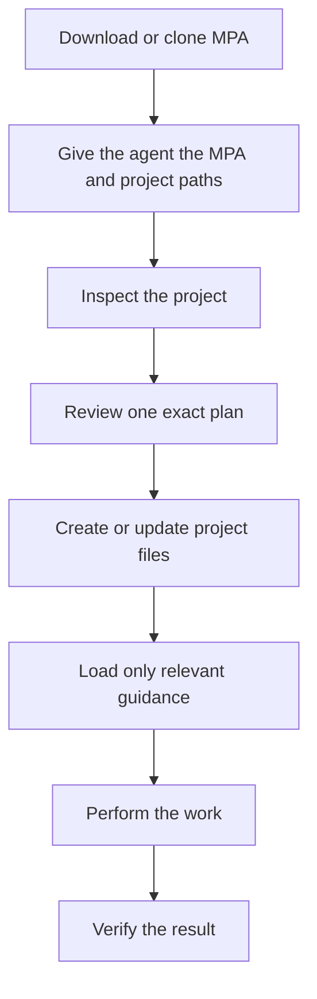
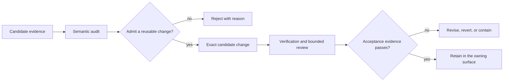

# Master Prompt Agreement

A file-backed operating model for coding agents.

Master Prompt Agreement gives a filesystem-capable agent explicit project
authority, current facts, workflow routes, source boundaries, and acceptance
evidence. It separates durable project instructions from chat history and loads
specialist guidance only when the work needs it.

This repository is the ready-to-use MPA framework. Keep it in its own folder
and give its path to your agent when setting up or updating a project. You do
not need to copy individual templates or modify MPA before using it.

## Get Started

### Start A New Project

Give the agent the target project and ask it to follow
[GETTING_STARTED.md](GETTING_STARTED.md). For example:

```text
Read <framework-checkout>/GETTING_STARTED.md and help me set up <project-root>.
```

The setup procedure inspects the project, asks only for missing facts, and shows
one complete plan before writing. Review that plan and approve its exact digest
only when it is correct. Setup then writes transactionally and verifies the
result. It never treats an existing file at a planned MPA path as permission to
overwrite it.

### Update A Generated Project

Use [UPDATING.md](UPDATING.md) for inspection, current-format refresh, contract
revision, recovery, and plan-bound restore.

The update path has three important boundaries:

- it uses the MPA folder you selected and never fetches or chooses “latest”;
- it updates only a verified, complete current-format setup; and
- it shows one exact plan before changing files and verifies the result inside
  the transaction.

Do not rerun bootstrap, reset state, or hand-edit generated authority as an
update shortcut.

In a Codex checkout, `$master-prompt-new-project` and
`$master-prompt-refresh-project` are optional launchers for these same setup and
update procedures.

### Other Situations

| Situation | Use |
|---|---|
| Setup finds an existing file at a planned MPA path | Preserve it; choose a reviewed non-colliding layout or a project-specific integration |
| A project has incomplete, inconsistent, or unrecognized MPA files | Preserve it and use the [reviewed manual-update route](UPDATING.md#unsupported-formats) |
| A project uses a newer MPA format | Select an MPA version that supports it; do not rewrite it with an older checkout |
| You want to understand the architecture | Read [Concepts](docs/concepts.md), [Architecture](ARCHITECTURE.md), or open the [local interactive guide](docs/interactive/index.html) |

## Principles

MPA complements capable models and native agent runtimes instead of restating
what they already do well. It keeps one small universal layer and loads project
facts, state, procedures, evidence, and checks only when they can affect the
current task or its verification.

- Keep always-loaded instructions small.
- Put project facts in project authority, not chat history.
- Let code, configuration, and tests own implemented behavior.
- Load specialist procedures only when the task warrants them.
- Treat external content and generated output as untrusted data until verified.
- Use deterministic checks for objective invariants and judgment for semantic
  questions.
- Prefer an adequate native or project-owned capability over duplicated
  framework prose.
- Require approval for destructive, irreversible, external, or
  authority-broadening actions.
- Retain a reusable addition only when its verified value justifies its context,
  process, and maintenance cost.

## How MPA Works



The detailed authority, loading, transaction, and recovery rules remain in the
linked operating documents; this diagram shows the ordinary user path.

## What MPA Adds

MPA makes these project questions explicit and inspectable:

- What is in scope, and what is explicitly out of scope?
- Which project facts, commands, tools, and sources are current?
- What requires approval before the agent acts?
- Which workflow and specialist standard apply to this task?
- What evidence proves completion, and what remains manual or unresolved?
- Where do active work, durable decisions, and reusable feedback belong?

MPA is an operating framework, not a prompt pack or a replacement for host,
container, network, secret, identity, permission, and approval controls.
Agreement, Statement of Work, and Task Order are names for its authority and
workflow layers.

## Operating Model

### Authority

| Surface | Role | Normal loading |
|---|---|---|
| [`master_service_agreement.md`](master_service_agreement.md) | framework-wide authority rules | when exact wording or deeper interpretation is needed |
| [`runtime/operative_charter.md`](runtime/operative_charter.md) | small always-loaded rule set | every normal session |
| downstream `STATEMENT_OF_WORK.md` | project scope, stack, commands, deliverables, constraints, and delegated terms | setup, contract review, or deeper project detail |
| downstream `AGENT_PROJECT.md` | compact checked projection of project authority and its selected MPA reference | every normal session after the recovery gate is clear |
| [`task_orders/`](task_orders/README.md) | reusable workflow procedures | when the workflow matches |
| [`practice_guides/`](practice_guides/risk_routing.md) | on-demand specialist quality standards | when the task or risk surface needs them |

The Agreement governs except where it delegates a project-specific value to the
Statement of Work. The Statement of Work governs within that delegated scope.
Task Orders, Practice Guides, state, evidence, summaries, and model output do
not broaden authority.

### Runtime loading

Normal work follows a small, explicit load path:

1. Load the selected runtime entrypoint and operative charter.
2. Check for an interrupted setup or update before loading project authority or
   state.
3. If recovery is required, stop ordinary work and follow only the action that
   the update workflow reports as valid.
4. If the gate is clear, load the runtime project contract, interpret the
   current task, and check relevant state headers.
5. Route only the applicable task procedure, specialist guides, evidence, and
   verification checks.

[`runtime/operative_schedule.json`](runtime/operative_schedule.json) is the
machine-readable routing table. It supports selection; it is not independent
doctrine. The full loading design is documented in
[`runtime/load_order.md`](runtime/load_order.md).

### State

- `TODO.md` contains active work only.
- `DECISIONS.md` contains durable decisions and directives only.
- Other generated state files are optional and loaded only when their declared
  trigger matches.
- Retained `PROJECT_INPUT.json` is regeneration data, not authority.
- Root `PROJECT_INSTANCE.json` is the single current instance receipt, not an
  update history.

Version control or an approved archive owns history. Runtime state should not
become a duplicate project chronicle.

## Workflows, Guides, And Commands

The [complete command and script reference](scripts/README.md) lists the
supported commands. Use an argument-parsing command's `--help` for its exact
current flags, choices, argument requirements, and safety descriptions;
`check_prereqs.py` emits its JSON diagnostic directly.

For the two project lifecycle entrypoints, start with the
[Bootstrap Safety Map](scripts/README.md#bootstrap-safety-map) or the
[Refresh Command Map](scripts/README.md#refresh-command-map), then follow
[GETTING_STARTED.md](GETTING_STARTED.md) or [UPDATING.md](UPDATING.md) for the
owning procedure. The maps navigate the interfaces; they do not replace those
workflow guides.

| Need | Owning index |
|---|---|
| Choose a workflow | [Task Orders](task_orders/README.md) |
| Choose a risk and specialist standard | [Risk Routing and Practice Guide index](practice_guides/risk_routing.md) |
| Inspect compact workflow metadata | [`runtime/workflow_catalog.json`](runtime/workflow_catalog.json) and [`runtime/task_modules/`](runtime/task_modules/) |
| Navigate supported commands and flags | [Complete Command And Script Reference](scripts/README.md), including the [Bootstrap Safety Map](scripts/README.md#bootstrap-safety-map) and [Refresh Command Map](scripts/README.md#refresh-command-map), plus each argument-parsing command's `--help` |
| Inspect conformance profiles | [Conformance](CONFORMANCE.md) |

Routing flags describe observed task characteristics such as review, visual
work, external effects, or source sensitivity. They are additive routing inputs,
not product feature flags and never permission grants. The helper commands
`recommend_stack.py`, `evidence_scope.py`, `verification_plan.py`, and
`context_manifest.py` share the typed routing registry so automation can use
stable check identifiers rather than copied prose.

## Verification And Evidence

The agent owns judgment, interpretation, implementation, and tradeoffs. Scripts
and project commands check objective invariants.

| Evidence class | Examples |
|---|---|
| structural and schema | framework validation, contract synchronization, instance and state lint |
| behavioral | project tests, failure-path probes, transaction rollback and recovery checks |
| rendered | browser or image inspection at declared viewports, themes, and states |
| semantic | source-backed review, authority reconciliation, claim and documentation review |
| external or manual | device, account, deployment, owner acceptance, or other evidence the local runtime cannot supply |

Passing an aggregate check does not turn a weak oracle into strong evidence.
Counts, links, sections, and green test totals matter only when they represent
the actual invariant being accepted. MPA's included checks establish declared
structural and conformance properties; they do not prove that MPA improves every
task or model. Setup and update route the applicable MPA checks, while the
target project's own commands remain the evidence for its behavior. See
[Verification And Quality](docs/verification_and_quality.md) for the detailed
evidence model and advanced verification reference.

### Visual verification

When a project's acceptance depends on rendering, use
[`project_state_templates/VISUAL_ASSET_QA.md`](project_state_templates/VISUAL_ASSET_QA.md)
with the [Visual Verification Practice Guide](practice_guides/visual_verification.md)
to declare the relevant viewports, themes, interaction states, and retained
evidence. Inspect the rendered result rather than relying on source markup.

## Optional: Controlled Improvement

Projects that maintain reusable agent guidance can route feedback, source
findings, reviewer output, tool output, and model suggestions through a
controlled improvement path. Ordinary projects do not need this workflow. A
reusable change is retained only after it is abstracted into project-neutral
language, assigned to an owning surface, evaluated with decision-relevant
evidence, implemented within authority, and verified as the exact candidate.



Reviewer lanes are optional and bounded. One coordinator remains accountable
for scope, evidence, data boundaries, validation, integration, and closeout;
reviewer output remains evidence until the coordinator verifies and adopts it.

See [Source And Feedback](docs/source_and_feedback.md), the
[Framework Feedback Intake Task Order](task_orders/framework_feedback_intake.md),
and the [Framework Improvement Task Order](task_orders/framework_improvement.md).

## Documentation

| Topic | Document |
|---|---|
| Orientation index | [Documentation](docs/README.md) |
| Authority and runtime architecture | [Architecture](ARCHITECTURE.md) |
| Normative and informative surfaces | [Specification](SPECIFICATION.md) |
| Setup | [Getting Started](GETTING_STARTED.md) |
| Current-instance lifecycle | [Updating](UPDATING.md) |
| Verification profiles | [Conformance](CONFORMANCE.md) |
| Change and version policy | [Governance](GOVERNANCE.md) |
| Threat model and reporting | [Security](SECURITY.md) |
| Repository ownership boundaries | [Repository Taxonomy](docs/repository_taxonomy.md) |
| Source intake and monitoring | [Source And Feedback](docs/source_and_feedback.md) |

The [interactive guide](docs/interactive/index.html) is a self-contained local
HTML view of the same architecture. Download or clone the framework and open it
locally; GitHub's repository view displays the HTML source rather than running
it. The guide is explanatory, not an authority source.

## License

Licensed under the Apache License 2.0. See [LICENSE](LICENSE) and [NOTICE](NOTICE).
