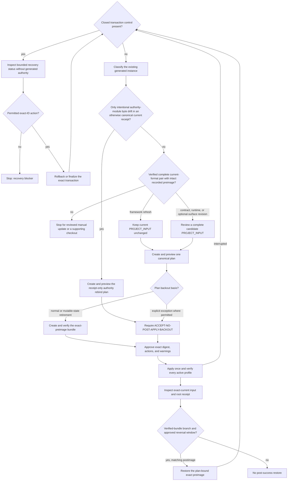

# Updating A Generated Project

Use this guide to inspect and classify an existing generated Master Prompt
Agreement instance. A verified complete current-format retained-input/receipt
pair with an intact recorded preimage is required for refresh planning,
contract revision, or runtime revision. The sole current-format exception is a
receipt-only rebind for intentionally reviewed external authority-module bytes;
the existing receipt must otherwise retain its exact canonical serialization.
Each plan selects exactly one backout
basis: the normal verified exact-preimage bundle, or the explicit
`ACCEPT-NO-POST-APPLY-BACKOUT` exception where the authoritative Task Order
permits it. Mutable-state retirement requires the bundle, and post-success
restore exists only on that bundle branch. Interrupted-transaction recovery is
a separate pre-authority branch bound to the closed control set and an exact
transaction identifier. A restored preimage need not be current against the
selected checkout. Initial creation belongs to
[Getting Started](GETTING_STARTED.md) and
[`task_orders/init.md`](task_orders/init.md).

This file is the operator orientation and command recipe. The workflow authority
is [`task_orders/framework_refresh.md`](task_orders/framework_refresh.md), and
`scripts/project_refresh.py <command> --help` is the exact flag authority. If
either changes, correct this guide rather than treating it as a second workflow
specification.

The recorded `<runner>` must retain the exact compatible CPython interpreter
and `-E -S -B` startup flags qualified by `scripts/check_prereqs.py`; do not
drop or reorder those flags when invoking refresh.

## Recovery Gate

Read `runtime/operative_charter.md` from the explicitly selected framework
checkout first. Then, before loading `AGENT_PROJECT.md`, the SOW, or project
state, check the project root for any member of the closed transaction-control
set: `.mpa-bootstrap-recovery.json`, `.mpa-bootstrap.lock`, or
`.mpa-bootstrap-recovery.tmp`.

`.mpa-bootstrap-recovery.previous` is transaction-internal preservation state,
not a fourth independent public startup-gate member. It must always coexist with
the durable `.mpa-bootstrap.lock`, and transaction cleanup must refuse to retire
that lock while `.previous` exists; an orphaned `.previous` artifact is invalid
recovery state. The public three-member gate remains sound only while this
mechanical invariant remains enforced and tested.

If any control artifact exists, stop ordinary project work and do not load
generated authority or state. Use only a runner already supplied by the runtime
or operator to inspect recovery status:

`<framework-checkout-as-visible-to-runner>` means the exact selected framework
path inside that runner's filesystem or mount namespace. A qualified wrapper
may set its workdir to the downstream project, so use this explicit path for
every framework script rather than bare `scripts/...`.

```bash
<runner> -- "<framework-checkout-as-visible-to-runner>/scripts/project_refresh.py" inspect --project-root <project-root>
```

Then, only when that report identifies a permitted recovery action and exact
transaction identifier, perform that action:

```bash
<runner> -- "<framework-checkout-as-visible-to-runner>/scripts/project_refresh.py" recover --project-root <project-root> --action <rollback|finalize> --approve-transaction-id <transaction-id>
```

If no runner is available without reading generated authority, report the
blocker and await direction. If inspection does not identify a permitted
recovery action, report that blocker and await direction. Do not edit or delete
any transaction-control artifact manually. A
runtime-native prelaunch gate is stronger than this portable prompt-level
ordering.

## File Roles

| Surface | Role |
|---|---|
| `STATEMENT_OF_WORK.md` | governing project authority |
| `AGENT_PROJECT.md` | generated governing terms plus a contract-model-owned, non-authoritative framework-reference binding; the SOW governs term conflicts |
| `PROJECT_INPUT.json` | retained, fully materialized regeneration input; data, not authority |
| project-root `PROJECT_INSTANCE.json` | single replaceable lifecycle receipt; its `contract_root` locates nested input and authority; not history |
| `TODO.md`, `DECISIONS.md`, and other mutable state | retained state is preserved byte for byte; only a candidate-disabled optional mutable surface may be retired through its explicit plan-bound removal |
| optional generated immutable brief such as `SOURCE_MONITOR_RESEARCHER.md` | regenerated from retained configuration and current framework procedure; project-specific additions use separate declared owners |

The retained input may contain project paths, commands, and other private facts.
Keep secrets out, minimize unnecessary sensitive material while preserving
required facts, and review it before tracking, sharing, or publishing a
downstream repository. Correct it through a candidate-input revision, never by
hand-editing the live file. Ignore rules in the framework checkout do not
sanitize a downstream repository.

The receipt carries the retained `contract_effective_date`; refresh adds no
timestamp or change log. One exact project root has one receipt even when its
contract root is nested. An independent monorepo component selects its own child
directory as the project root. Exact history belongs in version control or an
approved archive.

## Lifecycle



Refresh uses exactly the operator-selected local framework checkout. It never
fetches, pulls, installs, discovers, or chooses “latest.” Acquire or select a
different checkout through a separately authorized source or VCS workflow,
then run refresh from that checkout.

- `pinned` means the operator holds the reference at an intended revision until
  a separate explicit revision-selection action.
- `live` means the reference may expose changed operative-charter bytes before
  generated files refresh. Accept that boundary deliberately and refresh after
  the selected checkout changes.

Inspection separates the downstream-effective identity from the complete
product-distribution identity. `distribution-only-drift` with
`distribution_drift: true` is a provenance warning, not evidence that operative
files changed; `inspect --check` still fails because only exact `current`
succeeds. A current-format effective-file delta requires
`ACCEPT-SELECTED-FRAMEWORK-CHANGE`. A missing effective-file map or an absent,
one-sided, malformed, older, or unrecognized current pair—or recorded-input,
receipt-parity, digest, or managed-file preimage drift—is not a refresh shortcut;
it fails closed for a separately reviewed manual project update. A clearly newer
schema requires a framework checkout that supports it. A deliberate pinned
advance also requires `ADVANCE-PINNED-FRAMEWORK`.

## Ordinary Refresh Recipe

Run commands with the exact Framework Verification Runner recorded by the SOW
and the runner-visible selected framework path defined above. In the commands
below, `<contract-root>` is the safe project-relative path recorded by the
current root receipt; use `.` for the ordinary downstream layout.

1. Inspect without writing:

```bash
<runner> -- "<framework-checkout-as-visible-to-runner>/scripts/project_refresh.py" inspect --project-root <project-root> [--contract-root <matching-contract-root>]
```

For a current-format instance, omit `--contract-root` to derive it from the
single root receipt. If supplied, it must match the receipt. Use `--check` only
as an exact-current status gate. Inspection can also report recovery or an
active transaction, invalid state, a noncurrent input or receipt, an unsupported
recorded runtime, or a refresh condition. Follow the exact status. Only a
complete current-format pair can enter refresh planning. Partial, malformed,
inconsistent, older, or unrecognized formats stop for reviewed manual project
update; a clearly newer schema stops until a supporting checkout is selected.
Exact authority-module-only drift in an otherwise canonical schema-6 instance
instead reports `authority-module-rebind-required` with `errors: []`, exact
`authority_module_drift`, and `rebind_eligible`; this distinct lifecycle status
must not be collapsed into generic `manual-update-required`.

2. For a contract, runtime, or optional-surface revision, create and review a
temporary candidate input outside managed project surfaces. `--answers`
accepts the complete bootstrap answer object, not the retained
`PROJECT_INPUT.json` envelope; start from that envelope's `answers` member and
revise only the authorized fields. Enabling an optional surface adds its
canonical generated template. Disabling one proposes retirement of the exact
receipt-owned file under its recorded mutable or immutable partition; it does
not authorize ad hoc deletion. Then render the canonical candidate on stdout.
A downstream candidate requires its runtime family:

```bash
<runner> -- "<framework-checkout-as-visible-to-runner>/scripts/project_refresh.py" candidate --answers <temporary-revised-answers.json> --project-root <project-root> --project-kind downstream --contract-root <contract-root> --runtime <codex|claude-code|generic> --framework-ref <selected-framework-reference> --framework-revision-policy <live|pinned>
```

For a verified current downstream instance whose runtime family is unchanged,
omitting wrapper-selection flags preserves the current wrapper ID set; selected
wrappers are still regenerated from the chosen framework, so their bytes may
change. A runtime-family change must explicitly replace the wrapper selection:
repeat `--runtime-wrapper <id>` for every target wrapper, or use
`--clear-runtime-wrappers` for a deliberate empty set. A candidate is data and
does not amend the SOW until an approved transaction installs and verifies it.

3. Create one canonical no-write plan. Include `--candidate-input` only for a
contract, runtime, or optional-surface revision; omit it for a framework-only
refresh. Select exactly one plan backout basis. The normal branch uses the
private bundle root:

```bash
<runner> -- "<framework-checkout-as-visible-to-runner>/scripts/project_refresh.py" plan --project-root <project-root> [--contract-root <matching-contract-root>] [--candidate-input <temporary-candidate-project-input.json>] --backout-root <absolute-private-backout-root>
```

Only where the authoritative Task Order permits the exception, the explicit
no-post-apply-backout branch replaces `--backout-root` with:

```bash
<runner> -- "<framework-checkout-as-visible-to-runner>/scripts/project_refresh.py" plan --project-root <project-root> [--contract-root <matching-contract-root>] [--candidate-input <temporary-candidate-project-input.json>] --accept-no-post-apply-backout
```

For an otherwise current schema-6 instance whose only inconsistency is an
intentional change to receipt-recorded authority-module bytes, use the closed
receipt-only branch without a candidate input:

```bash
<runner> -- "<framework-checkout-as-visible-to-runner>/scripts/project_refresh.py" plan --project-root <project-root> [--contract-root <matching-contract-root>] --rebind-authority-modules --accept-no-post-apply-backout
```

The current receipt must already use its exact canonical byte serialization.
The plan must require exactly `REBIND-AUTHORITY-MODULES` and
`ACCEPT-NO-POST-APPLY-BACKOUT` in addition to its content-addressed warning,
and it may change only root `PROJECT_INSTANCE.json`. The preview exposes each
external authority module's exact UTF-8 text, label, path, SHA-256, and POSIX
rwx mode. Review those bytes and the receipt-only digest delta; any unrelated
receipt, input, generated-output, framework, or retirement change stops this
branch for separate handling.

Capture canonical JSON stdout in an approved temporary file outside managed
project surfaces. The plan embeds the exact candidate snapshot used by apply.
A normal schema-6 plan records current-receipt snapshots in
`current_authority_modules` and target-receipt snapshots in `authority_modules`.
Each list has unique canonical paths with one owner label per path. Preview must
reproduce both lists and their exact UTF-8 text before approval, and apply
asserts their union throughout installation. The rebind branch leaves
`current_authority_modules` empty because superseded bytes are unavailable and
binds the exact reviewed live bytes in `authority_modules`.
The planning command itself does not write the project root, its parent, or an
implicit scratch tree: it renders candidate bytes in memory, and it derives any
new-file and new-directory POSIX rwx modes from the process umask while
immediately restoring that umask. Planning performs retained-input, rendering,
preimage, topology, warning, and canonical-plan validation; it does not run the
active conformance profiles against a surrogate filesystem copy. Those profiles
run against the exact real project tree, preserving the retained framework
reference's live resolution: directly for a no-op, and after candidate
installation inside apply's rollback-capable transaction for a mutating plan.
Any change to the runtime family or its resolved wrapper-output mapping adds the
named `REVISE-RUNTIME-WRAPPERS` approval in addition to path-specific retirement
approvals.
Each candidate-disabled optional surface produces one numbered
`RETIRE-MUTABLE-####` or `RETIRE-IMMUTABLE-####` approval matching its receipt
partition, one content-addressed warning naming the path, and a `remove`
operation that binds its exact current digest and POSIX rwx mode to an absent
target.

Before approving a mutating plan, rebuild its exact candidate without writing
the project and review every changed authority/runtime file in the plan-bound
preview:

```bash
<runner> -- "<framework-checkout-as-visible-to-runner>/scripts/project_refresh.py" preview --project-root <project-root> --plan <temporary-plan.json>
```

The preview returns the exact current and target text, unified diff, bound
digests, and planned POSIX rwx modes for each create, replace, or remove
operation. Keep it in an approved private temporary location when project
authority contains sensitive material.
If preview reports stale bytes or a digest mismatch, discard the plan and start
again; a hash-only approval is not semantic review of regenerated authority.

The normal mutating path uses an existing absolute, current-user-owned,
non-symlink backout directory outside the project with no group or world
permissions. It may contain private generated bytes; never track, share, or
publish it. Create and verify the plan-bound exact-preimage bundle while the
project still matches the plan:

```bash
<runner> -- "<framework-checkout-as-visible-to-runner>/scripts/project_refresh.py" backout-create --project-root <project-root> --plan <temporary-plan.json> --backout-root <absolute-private-backout-root>
<runner> -- "<framework-checkout-as-visible-to-runner>/scripts/project_refresh.py" backout-verify --project-root <project-root> --plan <temporary-plan.json> --backout-root <absolute-private-backout-root> --require-project-preimage
```

The normal plan records `USE-EXACT-PREIMAGE-BUNDLE` as a named action. Approve
that exact action only after the verified bundle and live preimage match the
reviewed plan.

Here, “exact preimage” means each affected regular file's bytes, existence, and
POSIX rwx mode, plus the bounded parent-directory topology introduced by apply.
It does not preserve or claim equivalence for ownership, ACLs, extended
attributes, timestamps, inode identity, platform-specific flags, or special
permission bits. A project that requires those properties needs a separately
reviewed project-specific manual update and preservation procedure.

An exceptional owner decision may instead plan with
`--accept-no-post-apply-backout`. That limitation requires the named
`ACCEPT-NO-POST-APPLY-BACKOUT` action. Transaction recovery protects an
incomplete write; it is not post-success reversal.
This exception cannot authorize optional mutable-state retirement: removing
receipt-owned state requires the verified exact-preimage bundle so the approved
post-success backout can restore its exact bytes, existence, and POSIX rwx mode.
Optional immutable-state retirement follows the plan's selected and approved
backout basis; its path-specific action and warning and its plan-bound current
digest and POSIX rwx mode remain mandatory in either mode.

4. Review the roots, both framework identities, exact effective-file delta,
input and preimage digests and modes, operations, preserved retained-state bytes
and modes, any explicitly retired optional-surface preimage and absent target,
active profiles, warnings, named actions, the exact bundle evidence or the
explicit no-post-apply-backout basis and its required named action,
`refresh_transaction_id`, and
`plan_sha256`. Establish an exclusive lifecycle window: the writer lock excludes
other lifecycle writers, not ordinary readers.

Only warning identifiers present in that canonical plan can be approved. An
added, removed, or changed warning is plan drift: stop, generate a new plan, and
review its complete digest and effects. Warning approval permits only the named
exact-plan condition; it does not waive an error, a later unplanned warning, or
the strict all-active-profile verification performed by apply.

5. Apply exactly the reviewed plan:

```bash
<runner> -- "<framework-checkout-as-visible-to-runner>/scripts/project_refresh.py" apply --project-root <project-root> --plan <temporary-plan.json> --approve-plan-sha256 <plan-sha256> [--approve-action <action-id> ...] [--approve-warning <warning-id> ...]
```

Apply revalidates the plan, selected checkout, approvals, applicable backout
basis, and preimage bytes and POSIX rwx modes.
Before marking the transaction verified, it runs every profile in the plan's
`active_profiles` list and treats either errors or warnings as non-passing. A
successful apply report therefore includes the all-active-profile verification
receipt; a profile error or warning blocks a no-op or triggers rollback of a
mutating candidate and cannot be approved through a plan warning identifier.
Apply reports `recovery-required` if a clean rollback cannot be proved.
Rerunning the same profiles immediately is not independent evidence.
After transaction cleanup, run the separate exact-current gate:

```bash
<runner> -- "<framework-checkout-as-visible-to-runner>/scripts/project_refresh.py" inspect --project-root <project-root> [--contract-root <matching-contract-root>] --check
```

If apply returns `recovery-required`, follow the Recovery Gate; do not retry.
If a later independent acceptance check fails after a successful apply, keep
the exclusive window and report the failed evidence. On the verified-bundle
branch, use the approved post-success restore while it remains valid or prepare
a new reviewed plan; the no-post-apply-backout branch has no restore route. Do
not hand-edit generated files.

Successful apply plus exact-current inspection is this workflow's acceptance
gate. Do not immediately repeat the same checks through the Compliance Task
Order; use compliance later as an independent drift audit, after a milestone,
or when resuming a dormant project.

For a separately required or post-recovery standalone acceptance run, execute
`core-project` first and then every remaining plan-listed profile, replacing
`<profile-id>` each time:

```bash
<runner> -- "<framework-checkout-as-visible-to-runner>/scripts/conformance_check.py" --profile <profile-id> --root <project-root> --project-kind downstream --contract-root <contract-root> --strict-warnings
```

6. Remove temporary candidate data after verification. Retain the exact plan
and, on the verified-bundle branch, its private bundle only for the approved
backout window, then remove them through approved cleanup. They are temporary
control evidence, not authority, history, or committable project state.

## Bundle-Creation Recovery

An interrupted `backout-create` is a separate transaction rooted at the private
bundle directory. Do not pass it to governed-project recovery or blindly rerun
creation. Use the exact plan, root, permitted action, and transaction ID:

```bash
<runner> -- "<framework-checkout-as-visible-to-runner>/scripts/project_refresh.py" backout-recover --project-root <project-root> --plan <temporary-plan.json> --backout-root <absolute-private-backout-root> --action <rollback|finalize> --approve-transaction-id <backout-transaction-id>
```

After rollback, recreate only while project preimages still match. After
finalization, rerun `backout-verify --require-project-preimage`.

## Post-Success Backout

This section applies only to a plan using the verified exact-preimage bundle;
the explicit no-post-apply-backout branch cannot enter it. The bundle stores
preimages only for paths changed by apply. Backout remains available only while
every plan-listed managed target—including preserved
targets without bundle blobs—still matches the plan's exact post-apply bytes
and POSIX rwx mode. Any later managed-target change closes this conservative
whole-instance restore window. Verify the bundle, approve both identities, and
restore transactionally:

```bash
<runner> -- "<framework-checkout-as-visible-to-runner>/scripts/project_refresh.py" backout-verify --project-root <project-root> --plan <temporary-plan.json> --backout-root <absolute-private-backout-root>
<runner> -- "<framework-checkout-as-visible-to-runner>/scripts/project_refresh.py" backout-restore --project-root <project-root> --plan <temporary-plan.json> --backout-root <absolute-private-backout-root> --approve-plan-sha256 <plan-sha256> --approve-refresh-transaction-id <refresh-transaction-id>
<runner> -- "<framework-checkout-as-visible-to-runner>/scripts/project_refresh.py" inspect --project-root <project-root> [--contract-root <matching-contract-root>]
```

The final inspection verifies the restored recorded preimage before comparing
it with the selected checkout. A correct historical restore may report a
refresh condition rather than `current`. Restore asserts the union of the
displaced target `authority_modules` and restored
`current_authority_modules` throughout its transaction, so neither side of an
authority-path transition is silently left unbound.

## Unsupported Formats

The supported lifecycle accepts only a complete current-format retained input and
root receipt. If both are absent, no framework-generated surface exists, and no
selected managed output path collides, the target is eligible for a first
current-format bootstrap. Preserve ordinary same-name files and follow the
collision route in `GETTING_STARTED.md`; absence of generated identity alone
does not authorize overwrite. If any
framework-generated surface exists while the pair is absent, partial,
malformed, older,
unrecognized, or inconsistent, inspection fails closed. Preserve the original
project, inventory the affected authority, runtime, state, and metadata
surfaces, and prepare a separately reviewed manual project update. A clearly
newer schema instead requires a framework checkout that supports it; the current
checkout must not interpret or rewrite it. Refresh does not reverse-parse prose,
infer missing authority, transform state, or expose compatibility flags.

Project-kind changes, contract-root relocation, retirement of required mutable
state, and unmanaged target collisions also fail closed in ordinary refresh.
Receipt-owned optional surfaces may be retired only by disabling their exact
candidate-input flag and approving the partition-matched plan-bound
`RETIRE-MUTABLE-####` or `RETIRE-IMMUTABLE-####` action, warning, and applicable
exact-preimage controls. Instance retirement is outside this workflow.
